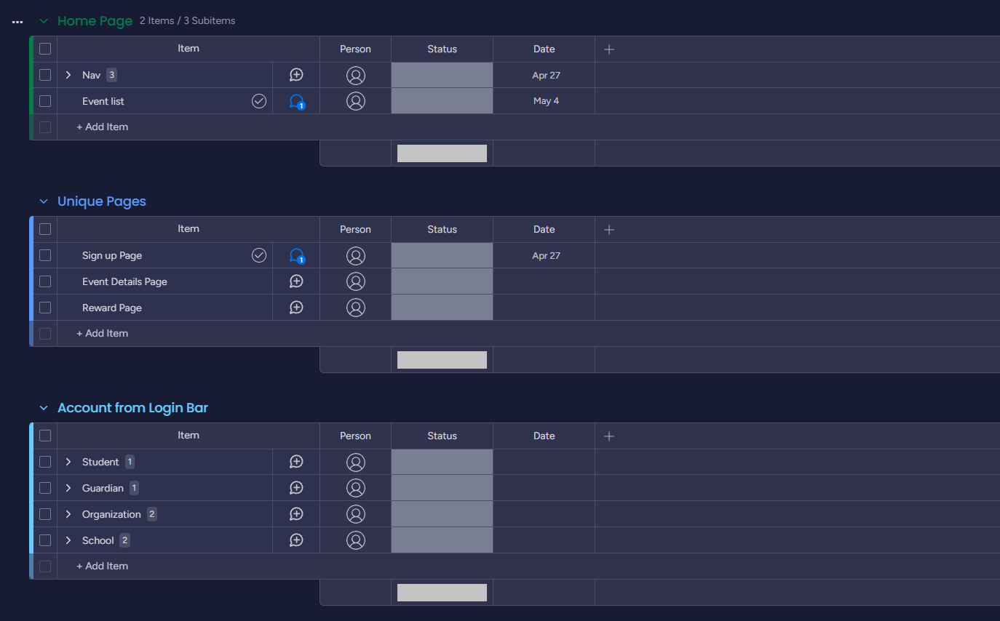
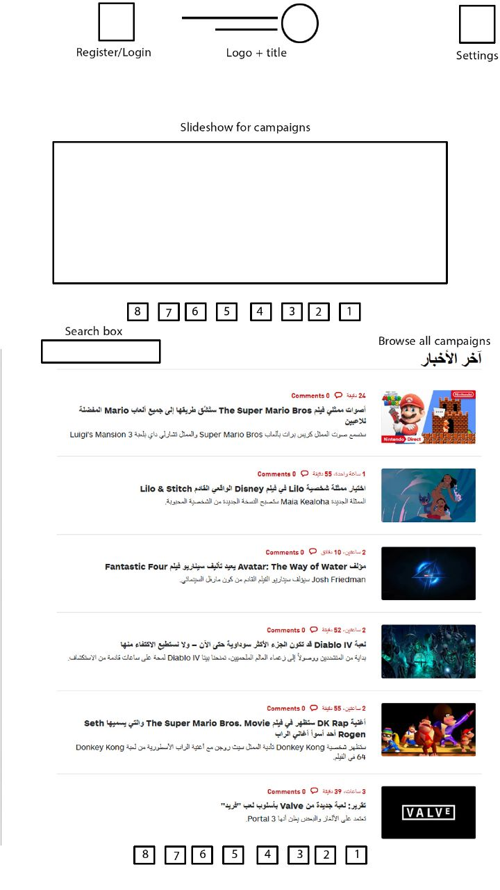
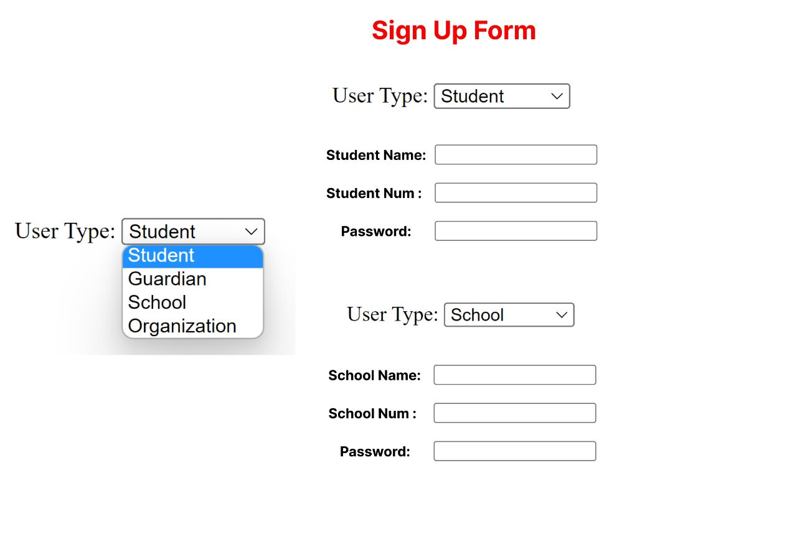
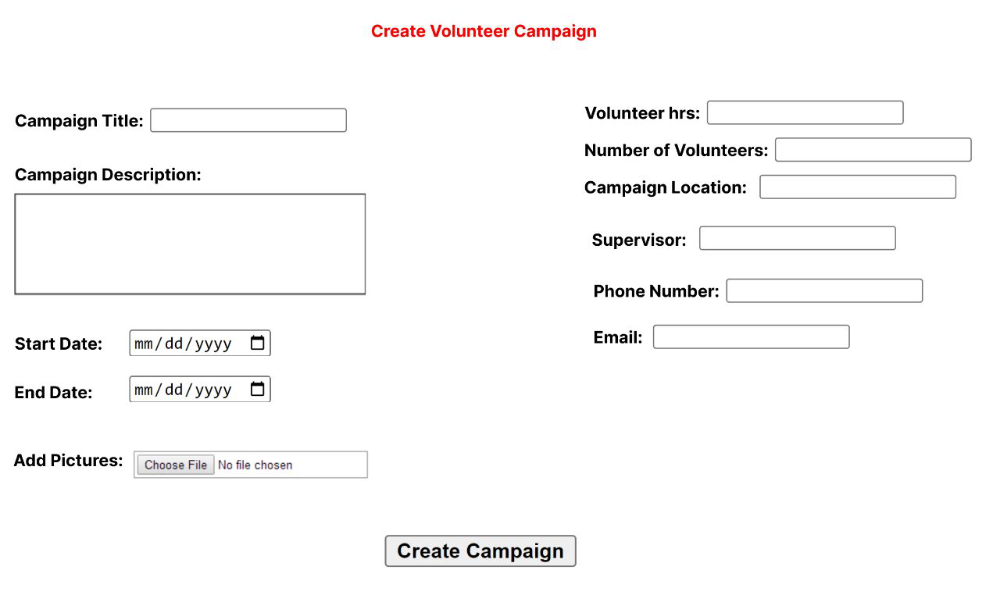
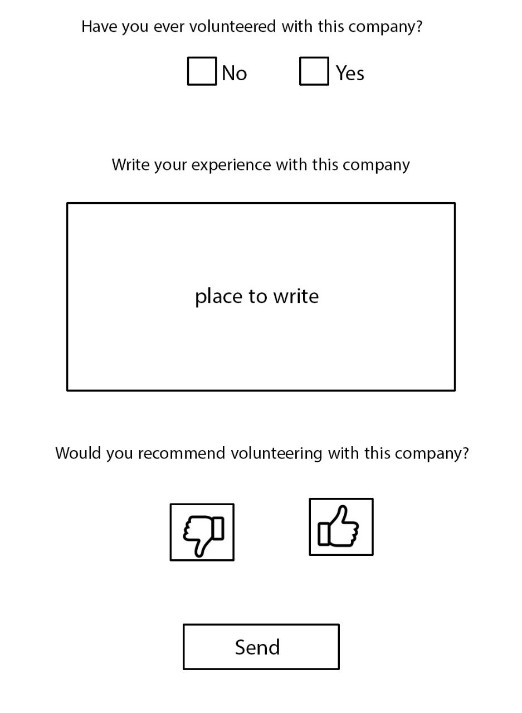
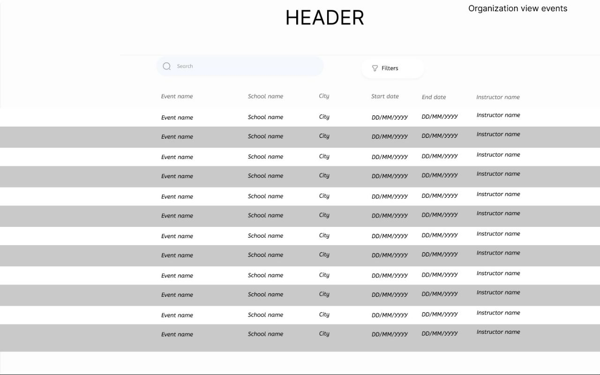

# Volunteer Platform for Student

Project discribition: 

    The issuance of the decision to add volunteer hours for high school students at the beginning of the current year, there have been problems in coordinating and managing volunteer 
hours for students and registering for volunteering campaigns due to there is no official platform that organizes this process for the students, presents volunteering opportunities for them and keeps records for their volunteering hours.

    Many schools and groups coordinate the volunteering campaigns via WhatsApp and social media, and this creates confusion between students and school administration.

    Moreover, the national volunteer platforms are very general, and do not take into account the circumstances and capabilities of students as most of them are not familiar with many 
technical matters and do not have the social and professional experiences not to mention they are under the legal age.

We are aim to:

    The aim of this project is to develop and produce an online platform that allows
students to browse and register in volunteering campaigns and allows the school
administration to monitor and track students' progress and makes it easier for
organizations to publish their volunteering campaigns advertisements.
The final product of this project will be a website for all concerned parties
(students + school + institutions).

Tasks:

    we wrote some tasks but it is not completed yet. But, we will try update it on a regular basis.

Few prototype we made:

    
    1- Home page:

    2- Sign up:

    3- Create a Campaign:

    4- Review page:

    5- View events histroy:

Obv it is still on progress and we will do our best to get the most and helpful website for our community to support them.

Thanks for reading :D

Winter Group #2 

